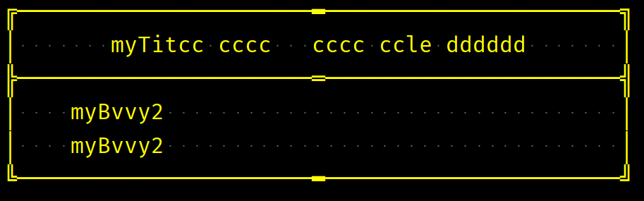
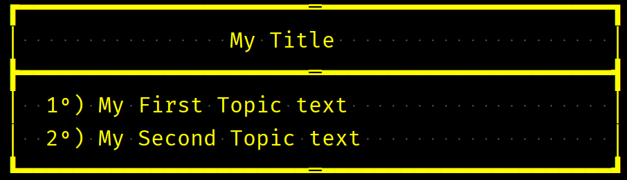

<h2 align="center">Learning Journey</h2>
<h2 align="center">Oracle Certified Professional: Java SE 17 Developer 1Z0-829</h2>

### Index

* [Disclaimer](#Disclaimer)
* [Objective](#objective)
* [StackOverFlow Requests](#stackoverflow-requests)
* [ASCII Sources](#ascii-sources)
* [Console Log Examples](#console-log-examples)

### Disclaimer
1. The strucuture of this app was done without any refactoring
2. Hence, it is possible to find some 'boiler-plate' integrating this solution.
 
### Objective
1. This little-app creates Log messages using bolders in console;
2. The objective of this solution is to solve a StackOVerFlow requests.
3. The main idea were to solve the problem using the most configurable solution found.

### StackOverFlow Requests
1. [Console-output-to-frame-text-area](https://stackoverflow.com/questions/32790698/console-output-to-frame-text-area)
2. [Creating-a-border-with-system-out-println](https://stackoverflow.com/questions/20244554/creating-a-border-with-system-out-println)

### ASCII Sources
1. Box Draw Special Characteres:
   * https://en.wikipedia.org/wiki/Box-drawing_character
2. Unicode symbols:
   * https://en.wikipedia.org/wiki/Unicode_symbols
   * https://en.wikipedia.org/wiki/Bullet_(typography) -- bullet
3. Ordinal indicator:
  * https://en.wikipedia.org/wiki/Ordinal_indicator

### Console Log Examples
 

 